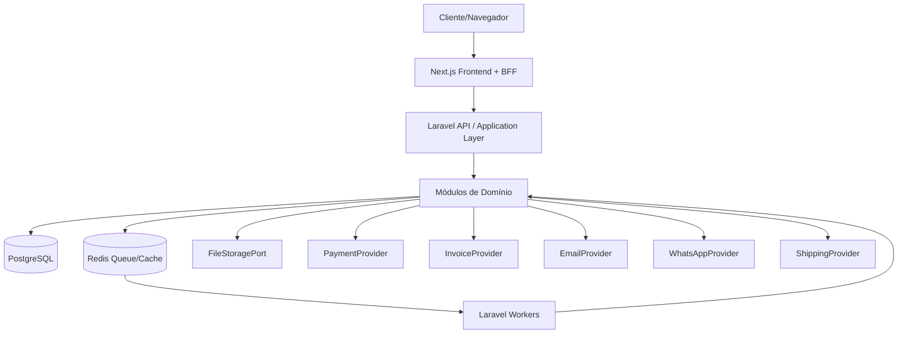
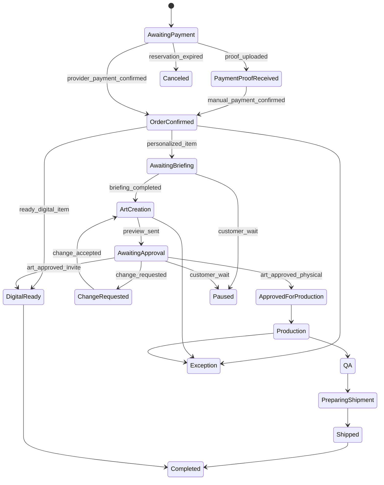

# Espinha de Arquitetura — JSDESIGN — Laravel API + Next.js BFF

## Paradigma de Design

Next.js como Frontend+BFF, Laravel como API de domínio, PostgreSQL como fonte transacional de verdade.



O navegador fala com o BFF Next.js. O BFF fala com a API Laravel. O Laravel é autoridade de domínio, estado e regras comerciais. Provedores externos entram por portas/adaptadores no backend. Banco, jobs, webhooks e admin compartilham a mesma regra de domínio.

## Invariantes e Regras

### AD-1 — Separação Frontend/BFF/API [ADOTADO]

- **Escopo:** loja, Área da Cliente, admin, SEO, checkout, pedidos
- **Risco evitado:** navegador acoplado à API interna, regras duplicadas no frontend e exposição de tokens/contratos sensíveis
- **Regra:** Next.js é Frontend+BFF. Laravel é API/backend de domínio. O navegador consome rotas/páginas do Next.js; Next.js chama Laravel por contratos server-side ou chamadas controladas.

### AD-2 — BFF não contém regra de negócio principal [ADOTADO]

- **Escopo:** BFF, UI, SSR, SEO, sessões, payloads
- **Risco evitado:** preço, pedido, pagamento, briefing ou aprovação divergirem entre BFF, Laravel, jobs e webhooks
- **Regra:** o BFF pode compor dados para tela, adaptar payloads, cuidar de SSR/SEO, sessão/cookies, cache de leitura e proxy seguro. Regras comerciais, transições e validações de domínio pertencem ao Laravel.

### AD-3 — Laravel é dono do domínio [ADOTADO]

- **Escopo:** carrinho, preços, pedidos, pagamentos, briefing, aprovação, produção, entrega, fatura, suporte, auditoria
- **Risco evitado:** controllers gordos, Eloquent como regra de negócio, jobs e webhooks implementando regras próprias
- **Regra:** Laravel organiza regras em módulos de domínio com camadas Application, Domain, Infrastructure e Interfaces/Http. Controllers e Jobs chamam casos de uso da camada Application.

### AD-4 — SOLID e Domain Pattern são contrato de implementação [ADOTADO]

- **Escopo:** backend Laravel, testes, manutenção
- **Risco evitado:** acoplamento a framework/provedor, baixa testabilidade e regras espalhadas
- **Regra:** entidades/objetos de domínio não dependem de HTTP, Eloquent, filas, storage ou gateways. Dependências externas entram por interfaces/ports e implementações em Infrastructure.

### AD-5 — PostgreSQL é a fonte transacional de verdade [ADOTADO]

- **Escopo:** pedidos, clientes, catálogo, carrinhos, pagamentos, briefing, arquivos, aprovações, suporte, auditoria, métricas
- **Risco evitado:** estado real dividido entre BFF, gateway, storage, WhatsApp, planilhas ou cache
- **Regra:** todo estado durável de negócio vive no PostgreSQL. Redis/cache melhora performance e fila, mas não substitui a verdade transacional.

### AD-6 — Pedido é o agregado central [ADOTADO]

- **Escopo:** UJ-1, UJ-2, UJ-3, UJ-4, UJ-5
- **Risco evitado:** briefing, prévias, miniaturas, suporte e entrega sem contexto comum
- **Regra:** `order_id` conecta cliente, itens, pagamento, briefing, arquivos, prévias, aprovação, produção, entrega digital, fatura, rastreio, suporte, notificações e auditoria.

### AD-7 — Estado financeiro é separado do estado comercial [ADOTADO]

- **Escopo:** checkout, webhooks, transferência, briefing, produção, downloads
- **Risco evitado:** liberar briefing, produção ou download por retorno de navegador, comprovante não conferido ou pagamento pendente
- **Regra:** `payment_state` e `order_state` são separados. Webhook confirmado ou confirmação manual auditada no Laravel são as únicas autoridades para pagamento confirmado.

### AD-8 — Fluxo do pedido usa máquina de estados explícita [ADOTADO]

- **Escopo:** pedidos, Área da Cliente, admin, produção, entrega
- **Risco evitado:** update livre que pula briefing, aprovação, QA, envio ou exceção
- **Regra:** transições ocorrem por comandos/casos de uso idempotentes no Laravel. BFF e UI apenas solicitam ações permitidas.



### AD-9 — API REST JSON versionada inicialmente

- **Escopo:** Next.js BFF, Laravel API, testes, integrações futuras
- **Risco evitado:** contratos implícitos e quebras silenciosas entre frontend/backend
- **Regra:** Laravel expõe contratos REST JSON em `/api/v1`. Contratos críticos devem ser testados por HTTP tests e documentáveis por OpenAPI quando a implementação começar.

### AD-10 — Autenticação e autorização centralizadas no Laravel

- **Escopo:** checkout guest, Área da Cliente, admin, arquivos privados, suporte
- **Risco evitado:** tokens sensíveis no navegador, acesso cruzado entre clientes, bypass de papel admin
- **Regra:** Laravel é autoridade de autenticação/autorização. Next.js BFF guarda sessão/cookies e nunca expõe segredo server-to-server ao navegador. Estratégia exata fica deferida entre Sanctum SPA/sessão compartilhada/token server-to-server.

### AD-11 — Arquivos privados são domínio do backend

- **Escopo:** fotos, referências, prévias, convites finais, produtos digitais prontos, QA
- **Risco evitado:** links públicos permanentes, enumeração, vazamento de imagem infantil ou acesso entre clientes
- **Regra:** Laravel controla autorização e metadados de arquivo no PostgreSQL. Storage privado entrega por URLs temporárias ou resposta controlada; BFF não bypassa autorização.

### AD-12 — Efeitos assíncronos pertencem ao Laravel

- **Escopo:** e-mail, WhatsApp, fatura, webhooks, antimalware, entrega digital, rastreio, lembretes
- **Risco evitado:** requisições web lentas e efeitos duplicados fora de transação
- **Regra:** Laravel grava outbox/notificação e processa jobs por filas. Redis é seed para fila/cache; jobs são idempotentes.

### AD-13 — Precificação e configuração são server-owned no Laravel

- **Escopo:** produto físico, convite, miniatura, carrinho, checkout, descontos, frete
- **Risco evitado:** subtotal divergente entre UI, BFF, checkout e admin
- **Regra:** Next.js exibe cálculos retornados pelo Laravel. Miniatura/personagem é cobrança compartilhada uma única vez por pedido/personagem. Desconto progressivo é automático; cupom por e-mail é manual por código.

### AD-14 — Briefing, aprovação e publicação autorizada são registros auditáveis

- **Escopo:** briefing, uploads, prévias, aprovação, produção, portfólio
- **Risco evitado:** produção com versão errada, publicação sem autorização e dados sensíveis expostos
- **Regra:** Laravel registra briefing mestre, prévias imutáveis, rodadas de alteração, aprovação final e autorização opcional de publicação. Convites publicados exigem dados sensíveis modificados/anônimos; lembrancinhas/miniaturas podem aparecer sem modificação quando autorizadas.

### AD-15 — CI/CD é obrigatório antes de desenvolvimento regular

- **Escopo:** backend, frontend, e2e, segurança, deploy
- **Risco evitado:** regressão, falta de testes e deploy sem verificação
- **Regra:** GitHub Actions deve rodar no mínimo lint/typecheck/build do frontend, testes PHP/Laravel, análise estática quando configurada, e Playwright para fluxos críticos. Pull requests não avançam se checks obrigatórios falharem.

## Stack

Seed verificado em 2026-07-27; patches exatos passam a ser controlados pelo código após o scaffold.

| Camada | Escolha |
| --- | --- |
| Frontend/BFF | Next.js 16.2.x + React 19.2.x + TypeScript |
| Backend/API | PHP 8.5.x + Laravel 13.x |
| Banco transacional | PostgreSQL 18.x |
| Cache/fila | Redis |
| Backend tests | Pest/PHPUnit + Laravel Feature/HTTP tests |
| Front/e2e tests | Playwright 1.60.x |
| CI/CD | GitHub Actions |
| API contract | REST JSON `/api/v1`, OpenAPI documentável |
| Arquitetura backend | SOLID + Domain Pattern + Ports/Adapters |

## Estrutura Inicial

```text
JSDESIGN/
  apps/
    web/                         # Next.js Frontend + BFF
      app/
      src/
        components/
        features/
        bff/
        i18n/
      tests/e2e/
    api/                         # Laravel API
      app/
        Modules/
          Catalog/
            Domain/
            Application/
            Infrastructure/
            Interfaces/Http/
          Cart/
          Pricing/
          Checkout/
          Orders/
          Briefing/
          Artwork/
          Files/
          Fulfillment/
          DigitalDelivery/
          Support/
          Notifications/
          Admin/
          I18n/
          Legal/
      database/
        migrations/
        seeders/
      tests/
        Feature/
        Unit/
  packages/
    contracts/                   # schemas OpenAPI/DTO compartilhados quando necessário
  infra/
    docker/
  .github/
    workflows/
```

## Mapa de Capacidades → Dono Técnico

| Capacidade | Dono principal | Observação |
| --- | --- | --- |
| Home, SEO, navegação, UX mobile | Next.js BFF | BFF compõe tela; dados vêm da API quando dinâmicos. |
| Catálogo e busca | Laravel Domain + PostgreSQL; Next exibe | BFF não decide disponibilidade/preço. |
| Produto/configuração/carrinho | Laravel Pricing/Cart; Next exibe | Cálculo server-owned. |
| Checkout/pagamento | Laravel Checkout + adapters; Next orquestra UI | Estado financeiro só no backend. |
| Área da Cliente | Next UI/BFF + Laravel Orders/Auth | Autorização no Laravel. |
| Briefing/uploads/prévias | Laravel Briefing/Files/Artwork | Storage privado controlado pelo backend. |
| Produção/QA/envio | Laravel Fulfillment | Admin usa mesma API/domínio. |
| Produto Digital Pronto | Laravel DigitalDelivery/Files | Liberação só após pagamento confirmado. |
| Suporte/Projeto Exclusivo | Laravel Support + Next widget | WhatsApp dentro do fluxo. |
| Admin | Next admin UI + Laravel Admin/Domain | RBAC/auditoria no Laravel. |
| Notificações | Laravel Notifications/Queues | Outbox/jobs idempotentes. |
| CI/CD | GitHub Actions | Deve cobrir front, back e e2e. |

## Decisões Adiadas

| Decisão | Motivo do adiamento |
| --- | --- |
| Hospedagem final | Depende de conta, orçamento e preferência operacional para Next, Laravel, PostgreSQL, Redis, workers e storage. |
| Estratégia exata de auth BFF↔Laravel | Sanctum SPA, sessão compartilhada ou token server-to-server dependem do domínio/hospedagem escolhido. |
| Storage privado | Pode ser S3 compatível, Supabase Storage ou equivalente; regra fixa é autorização pelo Laravel. |
| Provedor de pagamento | Stripe continua candidato, mas deve ser provado contra MB WAY, wallets, transferência, disputa, reembolso e conciliação. |
| Provedor fiscal/fatura | Depende de validação Portugal/UE, contabilista e ferramentas da atividade. |
| CTT/transportadora | Integração depende de conta/API; UX suporta rastreável e não rastreável. |
| Provedor e-mail/WhatsApp | Devem entrar por portas/adaptadores no Laravel. |
| OpenAPI obrigatório desde sprint 1 ou após primeiros contratos | API é REST versionada desde o início; documentação formal pode entrar quando houver endpoints estáveis. |
