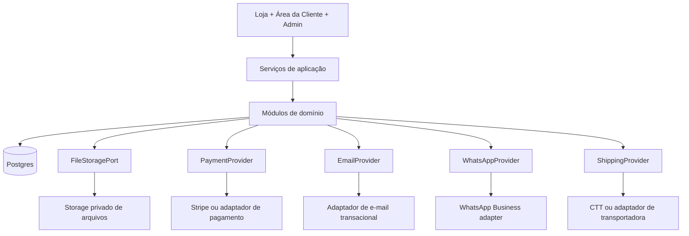
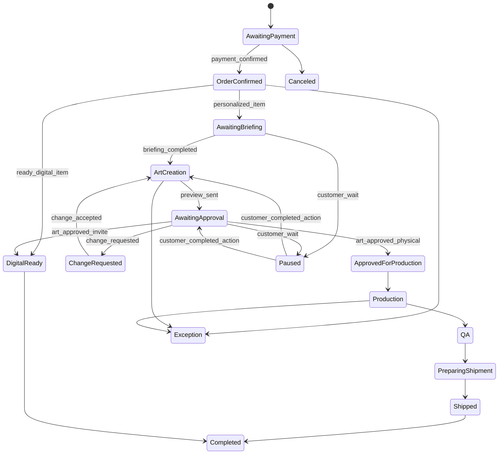
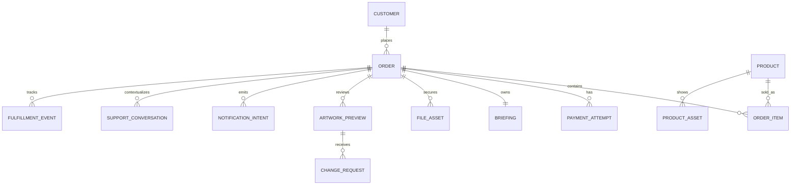

# Espinha de Arquitetura — JSDESIGN

## Paradigma de Design

Monólito modular full-stack com portas de domínio.



Todas as superfícies de UI chamam serviços de aplicação. Os serviços de aplicação aplicam as regras de domínio. Os módulos de domínio controlam transições de estado e emitem eventos para outbox. Adaptadores de provedores são portas substituíveis, não lugares para regra de negócio.

## Invariantes e Regras

### AD-1 — Fronteiras de monólito modular [ADOTADO]

- **Escopo:** todos
- **Risco evitado:** microserviços prematuros, lógica duplicada entre loja, admin, webhooks e Área da Cliente
- **Regra:** implementar como uma única aplicação web implantável, com módulos de domínio explícitos: `catalog`, `cart`, `pricing`, `checkout`, `orders`, `briefing`, `artwork`, `fulfillment`, `digital-delivery`, `support`, `notifications`, `admin`, `i18n`, `legal`.

### AD-2 — A UI nunca controla regras de negócio

- **Escopo:** loja, Área da Cliente, admin
- **Risco evitado:** regras diferentes entre mobile, desktop, admin e callbacks
- **Regra:** componentes podem coletar entrada e renderizar estado. Preço, elegibilidade, transições de estado, permissões, prazos e decisões de notificação rodam em serviços server-side de aplicação/domínio.

### AD-3 — Postgres é a fonte transacional de verdade

- **Escopo:** pedidos, clientes, catálogo, arquivos, aprovações, suporte, notificações
- **Risco evitado:** estado real dividido entre storage, gateway, e-mail, WhatsApp, CMS ou planilhas
- **Regra:** estado de negócio durável vive no Postgres. Provedores externos podem guardar identificadores operacionais, mas as linhas locais definem o que a aplicação considera verdadeiro.

### AD-4 — Pedido é o agregado central [ADOTADO]

- **Escopo:** UJ-1, UJ-2, UJ-3, UJ-4, UJ-5
- **Risco evitado:** briefing, prévias, miniaturas, suporte e entrega sem contexto comum
- **Regra:** `order_id` conecta cliente, itens, pagamento, briefing, arquivos, prévias, aprovação, produção, entrega digital, fatura, rastreio, conversas de suporte e notificações.

### AD-5 — Estado financeiro é separado do estado comercial [ADOTADO]

- **Escopo:** checkout, webhooks de pagamento, transferência bancária, entrega digital, liberação do briefing
- **Risco evitado:** liberar briefing, produção ou download por retorno de navegador ou pagamento pendente
- **Regra:** `payment_state` e `order_state` são separados. Webhooks do provedor de pagamento ou conciliação manual confirmada são as únicas autoridades que movem pagamento para confirmado.

### AD-6 — Fluxo do pedido é uma máquina de estados finita [ADOTADO]

- **Escopo:** pedidos, Área da Cliente, admin, produção/entrega
- **Risco evitado:** updates livres que pulem briefing, aprovação, produção, QA ou exceção
- **Regra:** estados de pedido/item transitam apenas por comandos nomeados e idempotentes. Escritas diretas em colunas de estado fora dos handlers de transição são proibidas.



### AD-7 — Itens personalizados devem ser configurados antes do carrinho [ADOTADO]

- **Escopo:** carrinho, produtos físicos, convites personalizados
- **Risco evitado:** carrinho incompleto, preço errado e briefing tentando corrigir escopo vendido
- **Regra:** linhas personalizadas no carrinho exigem configuração pré-carrinho. Produtos físicos exigem quantidade, tema, nome/texto, data quando aplicável e escolha de miniatura. Convites exigem tipo/modelo, tema e dados principais exigidos pelo modelo.

### AD-8 — Precificação é controlada pelo servidor e determinística

- **Escopo:** páginas de produto, configuradores, carrinho, checkout, admin
- **Risco evitado:** subtotal divergente entre UI, carrinho, checkout e administração
- **Regra:** o cliente exibe cálculos retornados por serviços de preço no servidor. Miniatura/personagem é uma cobrança compartilhada no nível do pedido, cobrada uma vez por pedido/personagem e reutilizável por itens compatíveis.

### AD-9 — Um briefing mestre por pedido/evento [ADOTADO]

- **Escopo:** briefing, produtos físicos, convites complexos, referências de miniatura
- **Risco evitado:** briefings duplicados e instruções conflitantes para o mesmo evento
- **Regra:** o briefing pós-pagamento é um registro mestre protegido por pedido/evento, com seções condicionais por modalidade de item.

### AD-10 — Arquivos privados usam metadados de storage e acesso temporário autorizado

- **Escopo:** uploads, referências, fotos infantis, prévias, convites finais, arquivos digitais prontos, fotos de QA
- **Risco evitado:** links públicos permanentes, acesso entre clientes e compartilhamento sem controle de mídia sensível
- **Regra:** arquivos vivem em storage privado de objetos. Postgres armazena dono, finalidade, classe de retenção e vínculo com pedido. Acesso é concedido por checagens de autorização e URLs temporárias assinadas ou entrega controlada equivalente.

### AD-11 — Notificações são efeitos colaterais via outbox

- **Escopo:** e-mail, WhatsApp, suporte, prévias, entrega digital, rastreio
- **Risco evitado:** notificações perdidas alterarem a verdade do negócio ou envios duplicados em retentativas
- **Regra:** comandos de domínio gravam intenções de notificação em uma outbox transacional. Workers/adaptadores enviam e-mail/WhatsApp. A Área da Cliente permanece como registro principal.

### AD-12 — Respostas de suporte são conteúdo curado

- **Escopo:** Suporte Online, escalonamento humano, WhatsApp
- **Risco evitado:** respostas generativas não aprovadas sobre preço, prazo, política ou detalhes privados do pedido
- **Regra:** suporte automático pode retornar apenas respostas aprovadas de uma tabela/base de conhecimento revisada. Escalonamento humano leva contexto e escolha consentida de canal.

### AD-13 — Acesso da cliente sem senha

- **Escopo:** checkout, Área da Cliente, downloads, aprovações, suporte
- **Risco evitado:** criação de conta bloquear compra mobile e links exporem pedidos privados
- **Regra:** checkout permanece compatível com compra como visitante. Acesso pós-compra usa código seguro/magic link para vincular sessão da cliente a pedidos autorizados.

### AD-14 — Internacionalização usa chaves, não cópias divergentes

- **Escopo:** loja, checkout, e-mails, respostas de suporte, metadados de SEO, políticas
- **Risco evitado:** português, inglês e espanhol divergirem em preço, status, prazo ou sentido legal
- **Regra:** interface e conteúdo transacional usam chaves de tradução. Valores de domínio permanecem normalizados. Troca de idioma não pode alterar carrinho, pedido, preço ou prazo.

### AD-15 — Admin é uma superfície operacional sobre o mesmo domínio

- **Escopo:** UJ-4, produção, QA, fila de exceções
- **Risco evitado:** planilha paralela, status manual fora do histórico e ficha de produção apontando para versão errada
- **Regra:** telas admin usam o mesmo agregado de pedido, comandos e modelo de autorização da aplicação vista pela cliente. Admin pode atuar em filas; não pode contornar invariantes do fluxo.

## Convenções de Consistência

| Tema | Convenção |
| --- | --- |
| Nomes de entidades | Nomes de domínio no singular no código: `Order`, `OrderItem`, `Customer`, `Briefing`, `ArtworkPreview`, `FileAsset`, `NotificationIntent`, `SupportConversation`. |
| Identificadores | IDs internos são UUID/ULID opacos. IDs visíveis para cliente usam referências estáveis com prefixo, como `JSD-1048`. |
| Datas | Armazenar timestamps em UTC. Exibir datas/horários no locale escolhido, com timezone explícito quando for operacionalmente relevante. |
| Dinheiro | Armazenar unidades menores inteiras mais moeda ISO. EUR é a moeda base. Não usar número de ponto flutuante para dinheiro. |
| Erros | Comandos de domínio retornam erros tipados com `code`, `message_key`, `field_path?`, `recoverable`, `next_action?`. |
| Idempotência | Webhooks de pagamento, envios de notificação, entregas de arquivo e transições de estado exigem chaves de idempotência. |
| Autorização | Toda consulta por pedido filtra por papel cliente/admin autenticado e `order_id`; acesso a arquivo nunca depende só de obscuridade. |
| Eventos | Eventos de domínio usam nomes no passado: `payment_confirmed`, `briefing_completed`, `preview_sent`, `art_approved`, `digital_file_delivered`. |
| Configuração | Credenciais de provedores, segredos de webhook, nomes de buckets e defaults de locale vivem em variáveis de ambiente, nunca no código-fonte. |
| Observabilidade | Registrar transições de estado, callbacks de provedor, tentativas de notificação, falhas de upload e escalonamento de suporte com IDs de correlação/pedido. |

## Stack

Seed verificado em 2026-07-27; o código controlará patches exatos depois da criação do projeto.

| Name | Version |
| --- | --- |
| Node.js | 24.x LTS |
| TypeScript | 6.x |
| React | 19.2.x |
| Next.js | 16.2.x |
| Tailwind CSS | 4.3.x |
| PostgreSQL | 18.x |
| Prisma ORM | 7.x |
| Stripe API | 2026-06-24.dahlia |
| Playwright | 1.60.x |

## Estrutura Inicial

```text
JSDESIGN/
  app/                         # rotas, layouts e server actions Next.js por superfície
    (storefront)/              # loja pública, catálogo, produto, entrada do carrinho
    (checkout)/                # checkout e estados de retorno do pagamento
    (customer)/                # Área da Cliente, briefing, aprovação, downloads
    (admin)/                   # filas admin e operações de pedido
    api/webhooks/              # somente webhooks de provedores
  modules/
    catalog/                   # produtos, modalidades, atributos de busca
    pricing/                   # faixas de quantidade, benefícios, compartilhamento de miniatura
    cart/                      # linhas de carrinho e configuração pré-carrinho
    checkout/                  # orquestração de checkout e criação de sessão de pagamento
    orders/                    # agregado, estados, transições, linha do tempo
    briefing/                  # briefing mestre e seções condicionais
    artwork/                   # prévias, aprovações, pedidos de alteração
    files/                     # metadados, autorização de storage, URLs assinadas
    fulfillment/               # produção, QA, envio/rastreio
    digital-delivery/          # entrega de digital pronto e convite aprovado
    support/                   # respostas curadas, conversas, escalonamento
    notifications/             # outbox e adaptadores de canal
    i18n/                      # chaves de tradução, formatação de locale
    legal/                     # aceite de políticas e texto de licença
  providers/
    payment/                   # adaptador Stripe atrás de PaymentProvider
    storage/                   # adaptador Supabase Storage atrás de FileStoragePort
    email/                     # adaptador de e-mail
    whatsapp/                  # adaptador WhatsApp
    shipping/                  # adaptador CTT/transportadora
  db/
    schema/                    # schema/migrations Prisma ou equivalente
    seeds/                     # seeds de catálogo/conteúdo de lançamento
  tests/
    e2e/                       # fluxos Playwright
    domain/                    # máquina de estados, preço, autorização
```



## Mapa de Capacidades → Arquitetura

| Capacidade / Área | Vive em | Governado por |
| --- | --- | --- |
| Descoberta, home, busca | `app/(storefront)`, `modules/catalog` | AD-1, AD-2, AD-14 |
| Produto físico personalizado | `modules/catalog`, `modules/cart`, `modules/pricing` | AD-7, AD-8 |
| Convite digital personalizado | `modules/catalog`, `modules/cart`, `modules/briefing`, `modules/artwork` | AD-7, AD-9 |
| Produto Digital Pronto | `modules/catalog`, `modules/checkout`, `modules/digital-delivery`, `modules/files` | AD-5, AD-10, AD-11 |
| Projeto Exclusivo | `modules/support`, `modules/notifications` | AD-12, AD-15 |
| Carrinho e checkout | `modules/cart`, `modules/pricing`, `modules/checkout` | AD-5, AD-7, AD-8, AD-13 |
| Pagamentos | `modules/checkout`, `providers/payment`, `app/api/webhooks` | AD-5, AD-11 |
| Briefing | `modules/briefing`, `modules/files` | AD-9, AD-10, AD-13 |
| Aprovação de arte | `modules/artwork`, `modules/orders` | AD-6, AD-10, AD-11 |
| Produção, QA e envio | `modules/fulfillment`, `providers/shipping` | AD-6, AD-10, AD-15 |
| Área da Cliente | `app/(customer)`, `modules/orders`, `modules/files` | AD-4, AD-6, AD-10, AD-13 |
| Suporte Online | `modules/support`, `providers/whatsapp`, `modules/notifications` | AD-11, AD-12 |
| Administração | `app/(admin)`, all domain modules | AD-6, AD-15 |
| Internacionalização | `modules/i18n`, content tables | AD-14 |
| Privacidade/legal | `modules/files`, `modules/legal`, `modules/checkout` | AD-10, AD-13, AD-14 |

## Decisões Adiadas

| Decisão | Motivo do adiamento |
| --- | --- |
| Hospedagem/provedor final | Depende de conta, orçamento, preferência de deploy e decisão de residência de dados. A arquitetura exige apenas uma aplicação implantável mais Postgres/storage gerenciado. |
| Supabase como plataforma gerenciada | Encaixa no modelo atual de portas para Postgres/Auth/Storage, mas deve ser confirmado contra conta, custo, backup e região antes de vincular. |
| Stripe Checkout Sessions vs Payment Links | Ambos encaixam no modelo de porta de pagamento. Escolher durante a implementação após confirmar cupom, fatura, webhook e necessidades de UX do checkout. |
| Supabase Auth vs camada própria sem senha | Ambos encaixam na AD-13. Escolher depois de decidir se Supabase será a plataforma gerenciada. |
| Provedor fiscal/fatura | PRD exige NIF/fatura; escolha depende de requisitos fiscais Portugal/UE e ferramentas do negócio. |
| Profundidade da integração CTT/transportadora | UX já suporta rastreio disponível/indisponível. Integração depende de conta/API CTT ou transportadora. |
| Provedor de inbox/suporte | AD-12 exige respostas curadas e preservação de contexto; inbox/CRM exato pode ser selecionado depois. |
| Provedor WhatsApp | Meta Cloud API e provedores de inbox compatíveis encaixam no modelo de adaptador; escolher após confirmar verificação comercial, templates e inbox operacional. |
| Provedor de e-mail transacional | Resend e provedores equivalentes encaixam no modelo de adaptador; escolher após checar domínio, entregabilidade e preço. |
| Estados completos das subtelas admin | Invariantes admin estão fixos; telas detalhadas pertencem aos épicos/stories de admin. |
| Limites exatos de upload | UX permite muitos arquivos; limites técnicos dependem do plano de storage/provedor e orçamento de performance. |
